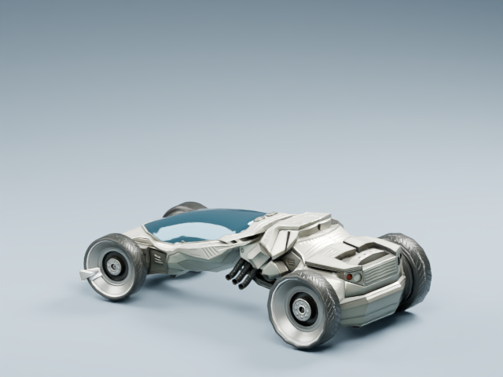
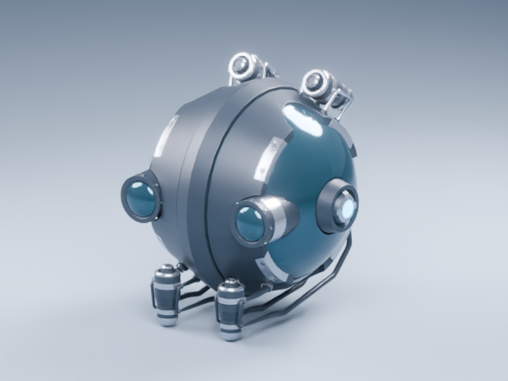
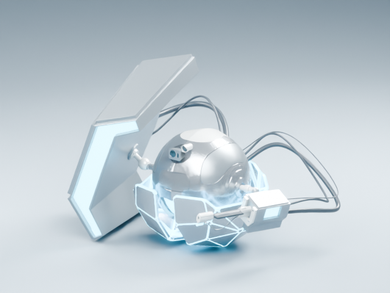

# BlendSwap asset credits

These static FBX derivatives are included in the native Echelon map import. Source downloads were obtained through the authorized BlendSwap account on 2026-09-13. Account credentials and original scene archives are kept outside this repository.

| Original model | Credit | License | Derivatives |
| --- | --- | --- | --- |
| [Futuristic Car](https://blendswap.com/blend/8745) | DennisH2010 (3DHaupt); vehicle concept by Piotr Kupsc | [Creative Commons Attribution 3.0](https://creativecommons.org/licenses/by/3.0/) | `bs_interceptor` |
| [Drone Ball](https://blendswap.com/blend/21029) | CFilip | [Creative Commons Attribution 3.0](https://creativecommons.org/licenses/by/3.0/) | `bs_drone_ball` |
| [BURT-VX-12](https://blendswap.com/blend/25188) | THEREALDUSTIN | [CC0](https://creativecommons.org/publicdomain/zero/1.0/) | `bs_burt_drone` |
| [Blade runner style Cityscapes](https://blendswap.com/blend/24947) | Suraj99 | [CC-BY](https://creativecommons.org/licenses/by/4.0/) | `bs_tower_a`, `bs_tower_b`, `bs_tower_c` |
| [miscellaneous greeble pack](https://blendswap.com/blend/24058) | spacehead | [CC-BY](https://creativecommons.org/licenses/by/4.0/) | `bs_airlock`, `bs_antenna`, `bs_relay` |

Changes: selected geometry, applied modifiers with subdivision capped at one level, normalized scale and pivots, corrected tower orientation, consolidated material slots, and replaced legacy shaders with portable PBR materials. The car retains its supplied color and normal textures. Unreal adds seeded facade windows and drone patrol motion. These are adapted game assets, not unchanged source scenes.

Original car and Drone Ball license notices are retained in `Licenses/`. Their bundled CC BY 3.0 notices take precedence over the catalog’s generic CC BY 4.0 link. Car credit includes DennisH2010 (now 3DHaupt) and concept artist Piotr Kupsc.

Source scene HDRIs, reference photographs, scripts, and unrelated props are omitted. In particular, the city source’s Pro Lighting Skies HDRI is not included.

Nine source assets were downloaded in total without spending credits. Secret Agent Elena, Secret Agent, Tears of Steel Quad Bot, and Urban / City street remain in private staging for rig, texture, and optimization review; they are not included in this import.

Rebuild with Blender 4.5.13:

```sh
blender -b -t 2 --factory-startup --disable-autoexec --python-exit-code 1 --python Build/export_blendswap.py -- /path/to/private/blendswap-staging
```

The manifest records dimensions, polygon counts, material definitions, source URLs, and attribution. The Unreal importer checks mesh dimensions and material names before saving the map.

## Blender review renders

These neutral studio renders show the adapted geometry; they are not in-game screenshots.






